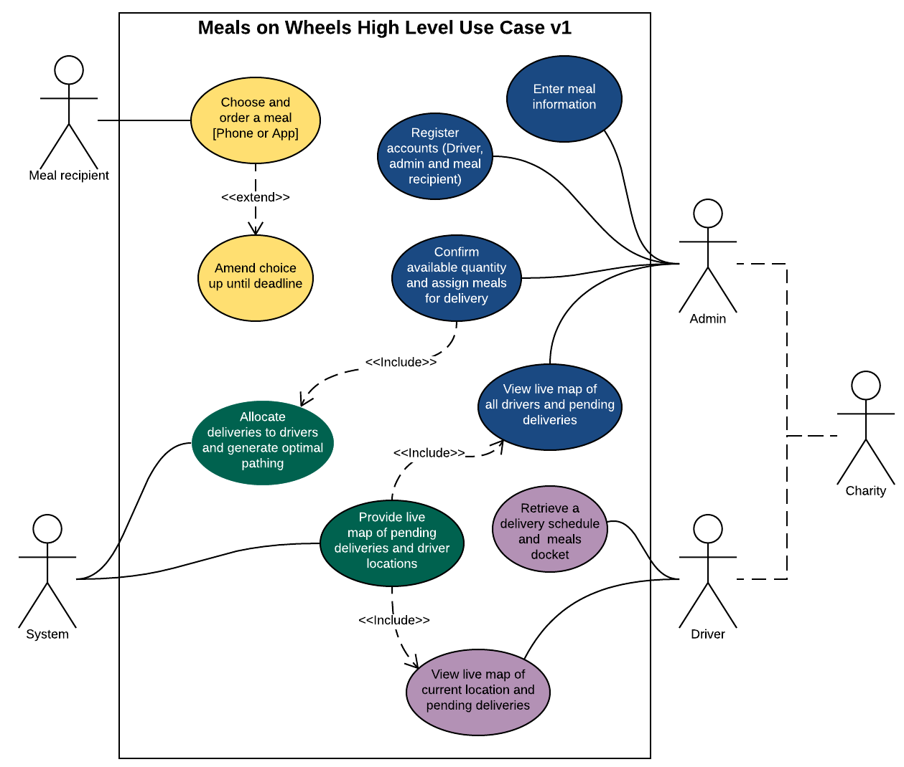

# Meals-on-Wheels
Charity meals on wheels web app

The application is divided in two modules:

### Back End
Download just the /server/meals-on-wheels module see the /server/meals-on-wheels/src/main/resources/README.txt for more info.

### Front End
Download the whole project but focus only on the files in the /client folder.

### High Level Use Case

